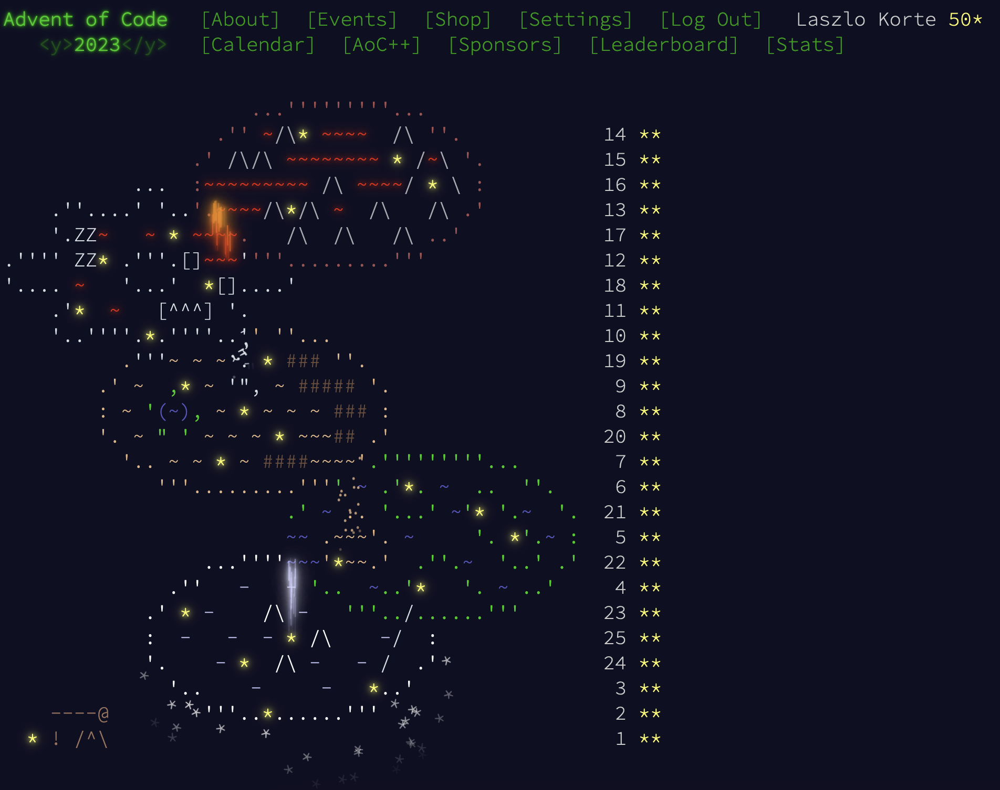

# My attempt at Advent of Code 2023 in Elixir



## Run a single day

```sh
mix run -e 'Day1.all'
```

## Run a single challange

```sh
mix run -e 'Day1.part1_test'
mix run -e 'Day1.part1_prod'
mix run -e 'Day1.part2_test'
mix run -e 'Day1.part2_prod'
```

## Run all challanges at once

```sh
mix run -e 'AOC.all'
```

## Generate Template for a new Day

```sh
mix run -e 'AOC.setup_day(25)' # for day 25
```